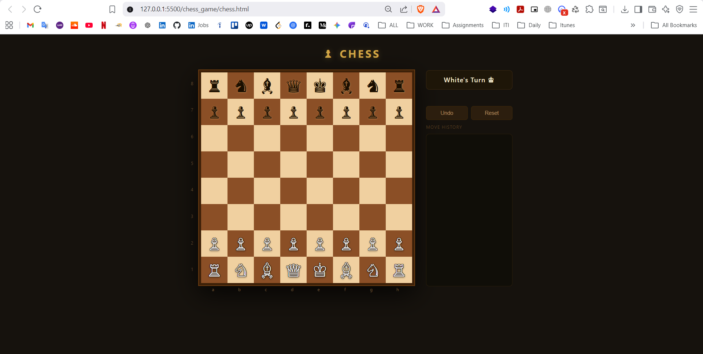
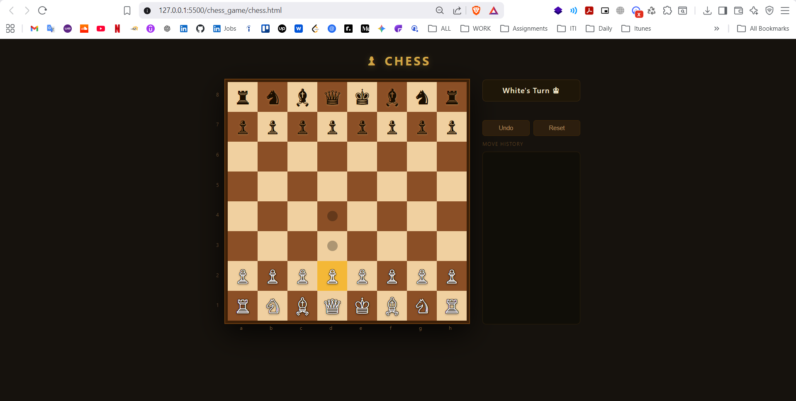
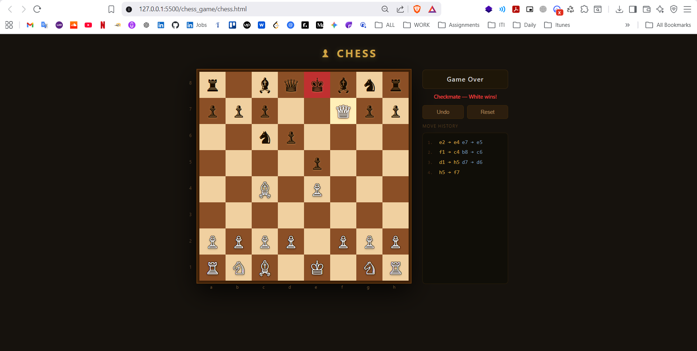
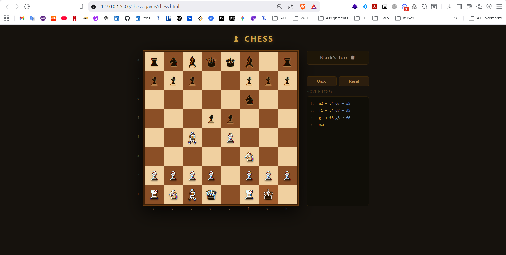
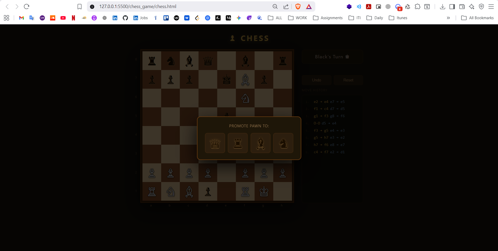
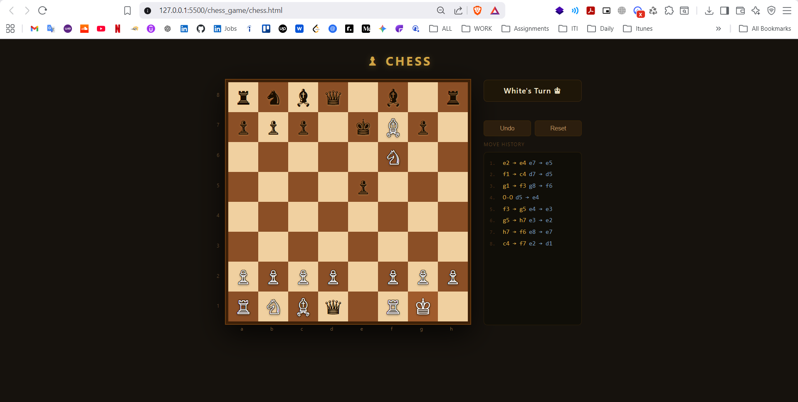

# Chess

A chess game that runs in the browser. No installs, just open the file and play.

**[Try it live](https://aahmed1009.github.io/chess_game/chess.html)**



## How to play

Click a piece to select it — the valid moves light up on the board. Click a highlighted square to move there. White goes first.



If your king is in check the square turns red and you have to deal with it before doing anything else.




**Castling** — just click the king two squares to the side, the rook moves on its own.

**Pawn promotion** — when a pawn reaches the other end, a dialog pops up and you pick what to promote it to.




**Undo** — takes back the last move. Keep pressing it to go further back.

The move history shows on the right as you play.

## Files

```
chess_game/
├── chess.html
├── script.js
└── style.css
```

Open `chess.html` in any browser and it just works.
